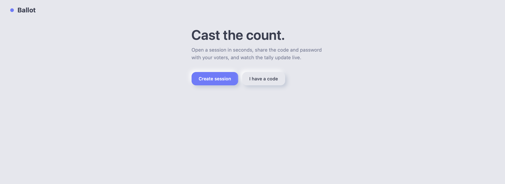
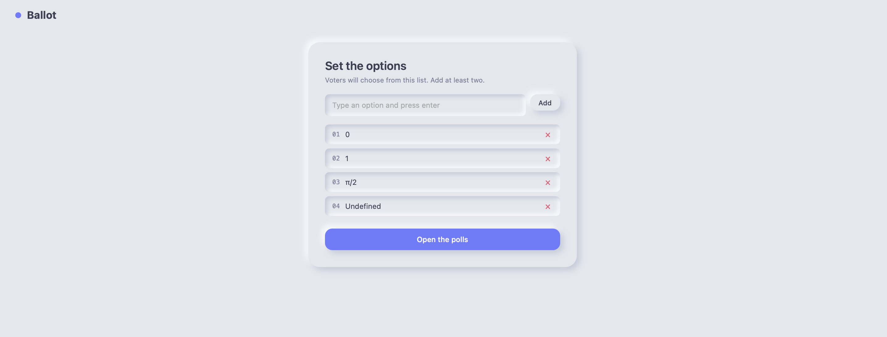
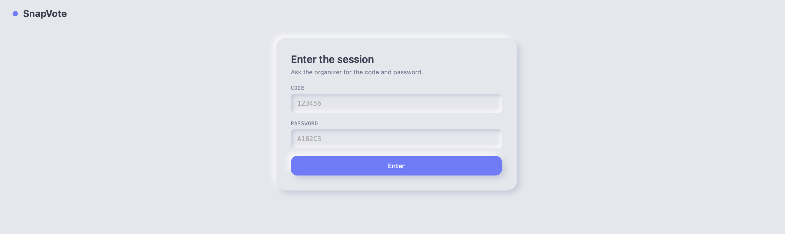
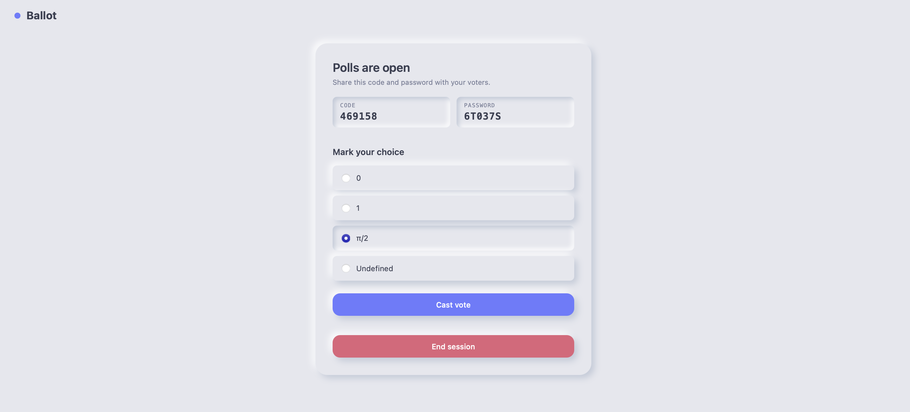

# SnapVote

A real-time voting application built with React, FastAPI, and Redis.

---

## Tech Stack

### Frontend


### Backend


### Database


### Authentication


## App Walkthrough

### 1. Landing Page


*User can either create a new session or join an existing session.*

---

### 2. Admin Setup


*Admin sets the voting options.*

---

### 3. Join Session


*User enters session code and password.*

---

### 4. Voting


*User votes for their desired option.*

---

### 5. Results


*Session ended. Final results displayed.*

---

### Backend Setup

1. **Create and activate a virtual environment**

```bash
python3 -m venv venv
source venv/bin/activate  # On Windows: venv\Scripts\activate
```

2. **Install dependencies**

```bash
pip install -r requirements.txt
```
---
### Environment Variables

Create a `.env` file in the `backend/` directory:

```env
JWT_SECRET = your-secret-key
```

---

### FastAPI Setup

```bash
cd backend
uvicorn main:app --reload
```
> The backend will run at `http://localhost:8000`

---

### Redis Setup

Start Redis in a **separate terminal**:

```bash
redis-server
```
> Redis will run on `localhost:6379`

---

### Frontend Setup

Open a **new terminal** and run:

```bash
cd ballot-frontend
npm install    # Only needed once
npm run dev
```
> The frontend will run at `http://localhost:5173`

---

### Access the App

Open your browser and navigate to:

```
http://localhost:5173
```

---
